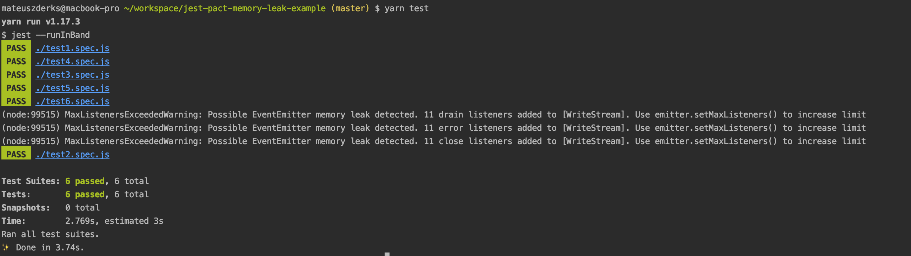

# jest-pact-memory-leak-example

This is the simplest project that allows to reproduce the EventEmitter
memory leak warning.

## The problem

The internal logger pipes to stdout stream as a side effect of importing the file:
https://github.com/pact-foundation/pact-js/blob/842185388ce1449c7cd47a51f5c44b80a4cc6771/src/common/logger.ts#L6

When using jest in band mode (--runInBand param) files are imported separately for each 
test file in the same process. That means stdout stream is piped repeatedly depending on 
the number of test files.

## Steps to reproduce
```
yarn test
```



## Steps to get rid of the warning

Dive into `./node_modules/@pact-foundation/pact/common/logger.js` and comment out
the mentioned line:

```js
prettyStdOut.pipe(process.stdout);
```

re-run `yarn test` and see no warning.
